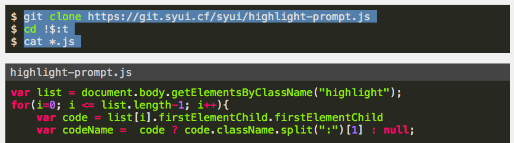

# highlight-prompt.js

add filename and prompt to highlight.js and hugo (syntax highlighting).



## example

```html
{{ $s := path.Dir (.Permalink | relURL) }}
{{ $t := index (split $s "/") 2 }}
{{ if eq $t "post" }}
	<body onload="highlight_prompt()">
{{ else }} 
	<body>
{{ end }}
```

```html
<script src="/js/highlight-prompt.js"></script>
<script src="/js/highlight-filename.js"></script>
```

```css
span.prompt {
    user-select: none;
}

pre > code {
    font-family: SFMono-Regular,Consolas,Liberation Mono,Menlo,Courier,monospace;
}
```
